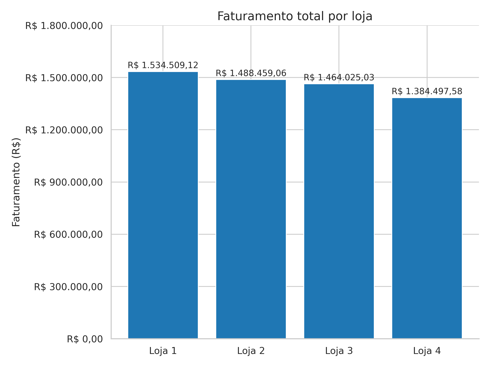
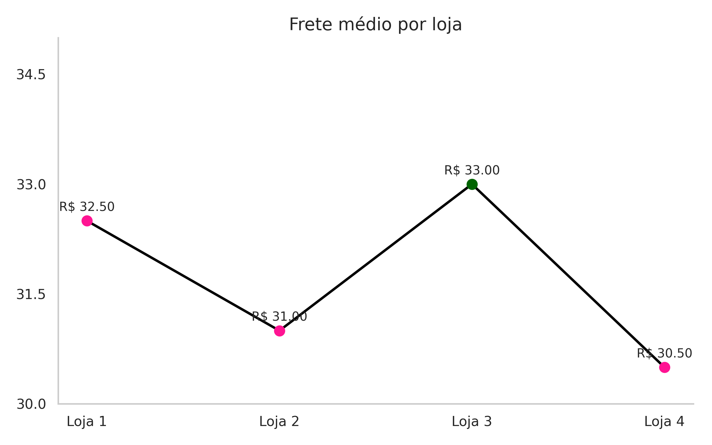

# challenge_DS_Alura

# 📊 Análise de Desempenho das Lojas – Rede Alura Store

Este projeto apresenta uma análise detalhada do desempenho financeiro e operacional das lojas da rede **Alura Store**, com o objetivo de identificar a unidade com menor retorno financeiro e recomendar ações estratégicas ao proprietário, Sr. João.

---

## 🧠 Contexto

Este desafio faz parte do processo de certificação em **Data Science** pela [Alura](https://www.alura.com.br/), e envolve a aplicação de técnicas analíticas para tomada de decisão baseada em dados reais.

---

## 🛠️ Tecnologias Utilizadas

- **Python** – linguagem principal para análise e visualização
- **NumPy** – manipulação de arrays e cálculos estatísticos
- **Matplotlib** – geração de gráficos e visualizações
- **Seaborn** – visualizações estatísticas avançadas

---

## 📈 Objetivo da Análise

> Identificar a loja com menor desempenho financeiro e recomendar ações estratégicas para otimização da rede.

---

## 🔍 Principais Indicadores Avaliados

- **Faturamento Total por Loja**
- **Avaliação Média dos Clientes**
- **Frete Médio por Loja**
- **Categorias de Maior Representatividade**

---

## 📈 Resultados Visuais

### 💰 Faturamento por Loja

### 📊 Porcentagem de Vendas por Loja

### ⭐ Avaliação Média dos Clientes por Loja

### 📦 Frete Médio por Loja

---

## 📊 Análise final

- A **Loja 4** apresentou o **menor faturamento da rede**, apesar de possuir avaliação satisfatória e o frete mais competitivo.
- A **Loja 1**, embora líder em faturamento, possui a **pior avaliação média** e o **frete mais caro**, indicando risco de perda de fidelização.

---

## ✅ Recomendação Estratégica

> Recomenda-se a **venda da Loja 4**, com base em seu baixo retorno financeiro e potencial de redistribuição de demanda para outras unidades.

---

## 📌 Conclusão

A análise orientada por dados permitiu identificar oportunidades de melhoria e propor ações estratégicas para fortalecer a operação da Alura Store. Este projeto demonstra a aplicação prática de ferramentas de **Data Science** na resolução de problemas reais de negócio.

---

## 📚 Certificação

Este projeto integra o portfólio de desafios para obtenção do **Certificado de Formação em Data Science** pela Alura.

---

## 📎 Arquivos

- `AluraStoreBr_(1).ipynb` – notebook com todo o processo analítico

- `README.md` – este documento

---

## 👩‍💻 Autora

**Ana Rachel Rodrigues da Costa**  
Analista de Dados | Data Science em formação  
🔗 [LinkedIn](https://www.linkedin.com/in/ana-rachel-rodrigues-da-costa-analista-de-dados/)

---
